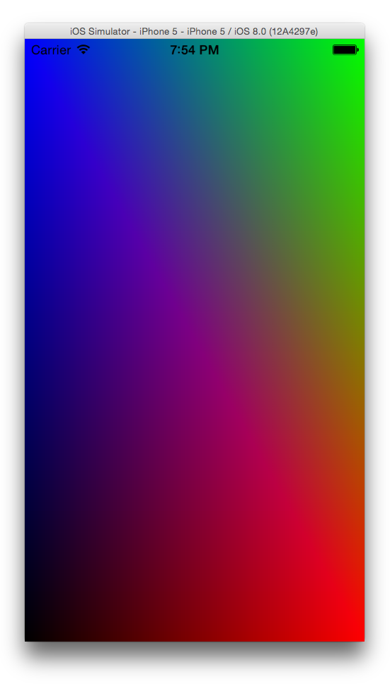

🚨🚨🚨
Notice: This repository stopped working properly after changes were made early on to the Swift language. After efforts on my part to repair the breakages, I have decided to use Metal instead for my purposes. You can [see example code here](https://github.com/bradley/iOSSwiftMetal).
🚨🚨🚨

#OpenGL for iOS using Swift

A basic example showing the use of OpenGL and GLSL Shaders in iOS using Swift.

*The code in this project is a direct port (as best I could accomplish anyway) of of the Objective-C code for OpenGL in iOS outlined by Ray Wenderlich in his [OpenGL for iOS Tutorial](http://www.raywenderlich.com/3664/opengl-tutorial-for-ios-opengl-es-2-0).*
